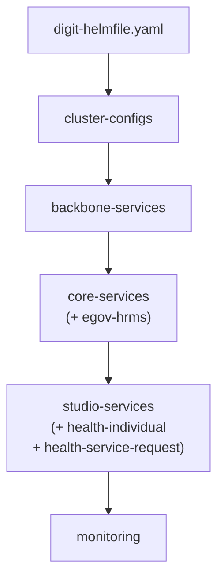

# egov-digit-studio-one-click-deployment

One-click Kubernetes deployment for **Digit Studio**, modeled on [DIGIT-DevOps](https://github.com/egovernments/DIGIT-DevOps) `deploy-as-code` with Helmfile composition.

All layers are orchestrated from a **single root helmfile**:

```
deploy-as-code/helm/digit-helmfile.yaml
```

## Architecture



| Layer | Helmfile | Namespace (default) | Services |
|-------|----------|----------------------|---------|
| Cluster config | `clusterconfigs-helmfile.yaml` | `egov` | Namespaces, configmaps, secrets, RBAC, root ingress |
| Backbone | `backboneservices-helmfile.yaml` | `backbone-dev` | postgres, kafka, redis, elasticsearch, minio, ingress-nginx, cert-manager |
| Core | `coreservices-helmfile.yaml` | `core-dev` | 18 DIGIT core services + egov-hrms |
| Studio | `studioservices-helmfile.yaml` | `studio-dev` | digit-studio, public-service, public-service-init, studio-individual, studio-pdf, studio-service-request, health-individual, health-service-request |
| Monitoring | `monitoring-helmfile.yaml` | `monitoring` | prometheus, grafana, loki, blackbox-exporter |

> Per-service namespaces are overridden in environment YAML (e.g. health-individual and health-service-request deploy to `egov` as defined in their `values.yaml`).

## Why cluster-configs is needed

`cluster-configs` is the **foundation layer** — it must be applied before any other service. It creates:

- **`egov-config` ConfigMap** — DB URL, Kafka brokers, Elasticsearch host, domain, timezone, and ~30 other platform parameters that every Java service reads at boot via env vars
- **`egov-service-host` ConfigMap** — internal service URLs used by all services for inter-service calls
- **Kubernetes Secrets** — DB credentials, mail/SMS keys, Elasticsearch creds, Kafka cluster ID, MinIO credentials; mounted by backbone and core services
- **RBAC** — cluster roles and role bindings for the service accounts
- **Namespaces** — if `cluster-configs.namespaces.create: true` in the env file
- **Root Ingress** — entry-point Ingress rule pointing at your gateway/load balancer

Without cluster-configs applied first, every service pod crashes immediately because the ConfigMaps and Secrets it mounts don't exist yet.

## Quick start

### Prerequisites

- Kubernetes cluster with `kubectl` configured
- [Helm](https://helm.sh/) v3+
- [Helmfile](https://github.com/helmfile/helmfile)
- [SOPS](https://github.com/getsops/sops) + AWS KMS access (for encrypted secrets)

### 1. Configure environment

Environment values live under `deploy-as-code/helm/environments/`:

| File pair | Use case |
|-----------|----------|
| `unified-demo-studio.yaml` + `-secrets.yaml` | **Recommended** — full studio stack |
| `unified-demo-staging.yaml` + `-secrets.yaml` | Staging with shared AWS RDS |
| `unified-demo.yaml` + `-secrets.yaml` | Full unified-demo cloud instance |

Edit the chosen `{env}.yaml` for your domain, DB host, and service host mappings.  
Decrypt secrets before deploy (SOPS + AWS KMS):

```bash
sops -d deploy-as-code/helm/environments/unified-demo-studio-secrets.yaml \
  > deploy-as-code/helm/environments/unified-demo-studio-secrets-dec.yaml
```

### 2. Deploy

```bash
chmod +x deploy.sh run.sh

# Full one-click deploy
HELMFILE_ENV=unified-demo-studio ./deploy.sh apply

# Preview diff before applying
HELMFILE_ENV=unified-demo-studio ./deploy.sh diff

# Render manifests to build.yaml
./run.sh
```

### 3. Partial deploys — toggle layers

Comment/uncomment paths in `deploy-as-code/helm/digit-helmfile.yaml`:

```yaml
helmfiles:
  - path: ./charts/cluster-configs/clusterconfigs-helmfile.yaml   # always required
  - path: ./charts/backbone-services/backboneservices-helmfile.yaml
  - path: ./charts/core-services/coreservices-helmfile.yaml
  - path: ./charts/studio-services/studioservices-helmfile.yaml
  # - path: ./charts/monitoring/monitoring-helmfile.yaml           # skip monitoring
```

### 4. Custom image tags

```bash
HELMFILE_ENV=unified-demo-studio \
COMMON_TAG=v2.9.2-4a60f20 \
HEALTH_INDIVIDUAL_TAG=Individual-master-register-studio-d307985 \
HEALTH_SERVICE_REQUEST_TAG=multiarch-changes-digit-studio-3fd88be \
./deploy.sh apply
```

## Directory layout

```
egov-digit-studio-one-click-deployment/
├── deploy.sh                          # One-click deploy script
├── run.sh                             # Template-only (build.yaml)
├── deploy-as-code/
│   ├── README.md                      # Common chart documentation
│   └── helm/
│       ├── digit-helmfile.yaml        # ROOT orchestrator (5 layers)
│       ├── .sops.yaml                 # SOPS KMS rules
│       ├── environments/              # Per-env values + secrets
│       └── charts/
│           ├── common/                # Shared library chart
│           ├── cluster-configs/       # Namespaces, configmaps, secrets, RBAC, ingress
│           ├── backbone-services/     # Infra (postgres, kafka, redis, ES, minio, …)
│           ├── core-services/         # DIGIT core microservices + egov-hrms
│           ├── studio-services/       # digit-studio stack + health services
│           └── monitoring/            # Prometheus, Grafana, Loki
```

## Known gaps

| Gap | Notes |
|-----|-------|
| **SOPS/KMS** | Secrets require AWS KMS key from `.sops.yaml`; decrypt before apply |
| **External RDS** | Default env files point at shared AWS RDS; for greenfield point `db-host` at in-cluster `postgres.backbone-dev` |
| **Gateway / digit-ui** | Studio UI served via `digit-studio` chart ingress directly; no separate gateway chart packaged |
| **Cluster bootstrap** | No Terraform/kind/EKS setup; an existing cluster is assumed |
| **CI/CD** | No GitHub Actions yet; mirror `digit_install.yml` from DIGIT-DevOps when ready |

## Local development alternative

For laptop development without Kubernetes, use the Compose stack in the sibling repo:

```
../egov-digit-studio/   → docker-compose + Tilt
```
